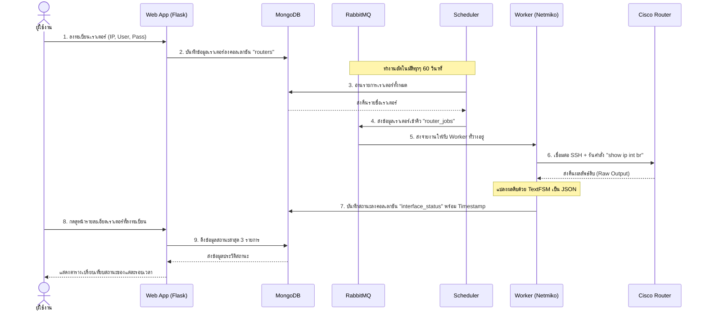

# Network Automation & Interface Monitoring System (ipa2025-msapp)

ระบบ Network Automation และ Monitoring สำหรับตรวจสอบสถานะของ Interface ของเราเตอร์ (Cisco IOS) แบบอัตโนมัติตามช่วงเวลาที่กำหนด พัฒนาด้วยสถาปัตยกรรมแบบ Microservices โดยทำงานผ่าน Docker Compose

---

## 🏗️ สถาปัตยกรรมระบบ (System Architecture)

ระบบแบ่งออกเป็น 5 บริการหลักที่ทำงานเชื่อมต่อกันผ่าน Docker Network ดังนี้:



### รายละเอียดของแต่ละบริการ
1. **`web`**: บริการเว็บแอปพลิเคชัน (Flask) รันบนพอร์ต `8080` เพื่อให้ผู้ใช้สามารถลงทะเบียน/ลบข้อมูลเราเตอร์ และดูตารางสรุปสถานะของแต่ละ Interface
2. **`mongo`**: ฐานข้อมูล MongoDB (พอร์ต `27017`) สำหรับเก็บข้อมูลเราเตอร์ (`routers`) และข้อมูลสถานะ Interface ที่ดึงมาได้ (`interface_status`)
3. **`rabbitmq`**: Message Broker (พอร์ต `5672` และ Management UI พอร์ต `15672`) ทำหน้าที่เป็นคิวเก็บงานตรวจจับสถานะเราเตอร์ (`router_jobs`)
4. **`scheduler`**: บริการเบื้องหลัง คอยดึงข้อมูลเราเตอร์จาก MongoDB ทุก ๆ 60 วินาที แล้วนำมาสร้างเป็นงาน (Jobs) ส่งเข้าไปยังคิวของ RabbitMQ
5. **`worker`**: บริการเบื้องหลัง คอยดึงงานจากคิว RabbitMQ จากนั้นใช้ **Netmiko** เชื่อมต่อ SSH เข้าไปรันคำสั่ง `show ip int br` บน Cisco Router จริง และแปลงข้อมูลดิบด้วย **TextFSM** เป็นข้อมูลโครงสร้างเพื่อนำไปเก็บลง MongoDB

---

## 📂 โครงสร้างของโปรเจค (Project Structure)

```text
├── web/                  # เว็บแอปพลิเคชัน (Flask)
│   ├── app.py            # พาร์ท Routing และการดึงข้อมูลจาก MongoDB
│   ├── templates/        # ไฟล์หน้าเว็บ HTML (index.html, router_detail.html)
│   └── static/           # ไฟล์ CSS สำหรับตกแต่งหน้าเว็บ
├── scheduler/            # บริการตั้งเวลารอบตรวจสอบ
│   ├── scheduler.py      # ลูปตั้งเวลารันงานและส่งงานเข้าคิว
│   ├── database.py       # เชื่อมต่อเพื่ออ่านข้อมูลเราเตอร์จาก MongoDB
│   └── producer.py       # ฟังก์ชันการต่อ RabbitMQ และส่งงาน
├── worker/               # บริการรันและเก็บข้อมูลด้วย Network Automation
│   ├── worker.py         # จุดเริ่มทำงานของ Worker
│   ├── consumer.py       # ฟังก์ชันรับงานจาก Queue ใน RabbitMQ
│   ├── callback.py       # จัดระเบียบกระบวนการทำงานเมื่อได้รับงาน
│   ├── router_client.py  # เชื่อมต่อไปยังเราเตอร์ผ่าน Netmiko + รันและตรวจจับค่า
│   └── database.py       # บันทึกข้อมูลผลลัพธ์ลง MongoDB
├── docker-compose.yml    # ไฟล์ตั้งค่า Docker Container orchestration
├── .env.example          # ตัวอย่างไฟล์ตั้งค่า Environment Variables
└── README.md             # เอกสารแนะนำการใช้งาน
```

---

## 🚀 วิธีการติดตั้งและเริ่มใช้งาน (Getting Started)

### 1. ความต้องการของระบบ (Prerequisites)
* ติดตั้ง [Docker](https://www.docker.com/) และ [Docker Compose](https://docs.docker.com/compose/) บนเครื่องคอมพิวเตอร์ของคุณ

### 2. ตั้งค่าไฟล์ Environment (.env)
ทำสำเนาไฟล์ `.env.example` เป็น `.env` และตั้งค่าความปลอดภัยของ MongoDB และ RabbitMQ ตามต้องการ:
```bash
cp .env.example .env
```

ภายในไฟล์ `.env` จะประกอบด้วยตัวแปรดังนี้:
```env
MONGO_INITDB_ROOT_USERNAME=admin
MONGO_INITDB_ROOT_PASSWORD=password123

RABBITMQ_DEFAULT_USER=admin
RABBITMQ_DEFAULT_PASS=password123
```

### 3. สั่งรันแอปพลิเคชันทั้งหมด
เปิด Terminal ขึ้นมาในโฟลเดอร์ของโปรเจคนี้ แล้วรันคำสั่ง:
```bash
docker compose up -d --build
```
ระบบจะทำการดาวน์โหลดอิมเมจ บิลด์ตัวเว็บ แอปพลิเคชัน ตัวคิวงาน และตัวประมวลผล พร้อมเปิดการทำงานเบื้องหลังโดยอัตโนมัติ

### 4. ตรวจสอบการใช้งาน
* **Web UI (หน้าเว็บจัดการอุปกรณ์)**: เข้าผ่านเบราว์เซอร์ไปที่ http://localhost:8080
* **RabbitMQ Management UI**: เข้าผ่านเบราว์เซอร์ไปที่ http://localhost:15672 (ใช้ User/Password ตามที่ตั้งใน `.env`)
* **ตรวจสอบ Logs**:
  ```bash
  docker compose logs -f
  ```

---

## 🛠️ รายละเอียดคำสั่งที่นำมาใช้งานในการดึงข้อมูลเราเตอร์
สคริปต์ของ Worker จะเข้าเราเตอร์แล้วส่งคำสั่ง:
```ios
show ip interface brief
```
และจะแปลงค่าผลลัพธ์ผ่าน **TextFSM (ntc-templates)** ออกมาเป็นรูปแบบ JSON เช่น:
```json
[
  {
    "interface": "FastEthernet0/0",
    "ip_address": "192.168.1.1",
    "status": "up",
    "proto": "up"
  },
  {
    "interface": "FastEthernet0/1",
    "ip_address": "unassigned",
    "status": "administratively down",
    "proto": "down"
  }
]
```
ซึ่งจะทำให้หน้าเว็บสามารถแสดงประวัติและสถานะการเชื่อมต่อได้อย่างสวยงามและถูกต้อง

